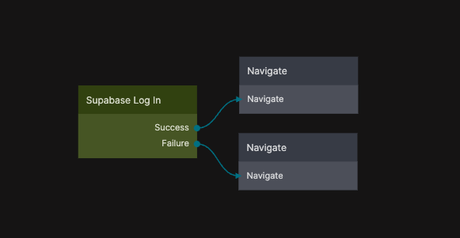

{/*##head##*/}

# Log In
 
Logs in an existing user using an email and password or a phone number and password.

This node authenticates the user against your connected Supabase project and, on success, creates an active user session. The session can then be used by other Supabase nodes in the app to access protected data, apply row-level security policies, and perform authenticated operations.

The Log In node is typically used as part of an authentication flow together with input fields for credentials and conditional logic to handle successful and failed login attempts.

This functionality is based on the Supabase Client SDK sign-in method. For implementation details and behavior, see  
[Supabase Client SDK – Sign in a user](https://supabase.com/docs/reference/javascript/auth-signinwithpassword).
