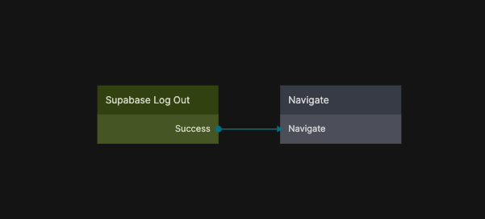

{/*##head##*/}

# Log Out
 
Logs out the currently authenticated user from the connected Supabase project.

This node clears the active user session and removes the user’s authentication state from the app. After logging out, any subsequent Supabase operations will be executed without an authenticated user until a new login occurs.

The Log Out node is typically used in navigation flows, account menus, or security-related actions where the user explicitly ends their session.

This functionality is based on the Supabase Client SDK sign-out method. For reference, see  
[Supabase Client SDK – Sign out a user](https://supabase.com/docs/reference/javascript/auth-signout).