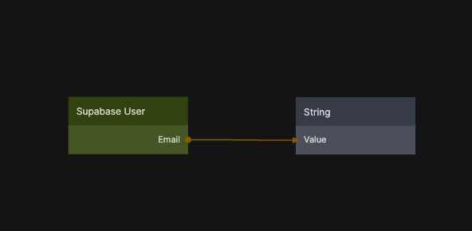

{/*##head##*/}

# User

Returns the currently authenticated user from the active Supabase session.

  

This node provides access to the user object associated with the current session. The returned data includes identifiers and metadata such as the user ID, email address, phone number, and any custom user metadata defined in Supabase.

The User node is commonly used to display account information, personalize the UI, or drive conditional logic based on whether a user is logged in or not. If no active session exists, the node returns `null`.

The returned user data reflects the authentication state managed by Supabase and automatically updates as the session changes.

{/*##head##*/}
