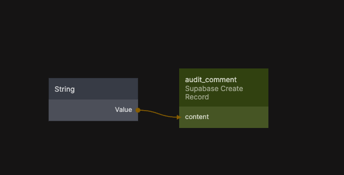

# Create New Record

Creates a new record in a specified Supabase table.

  

The Create New Record node inserts a new row into a selected table in your connected Supabase database. You define the field values either directly in the property panel or dynamically by connecting inputs from other nodes.

This node is commonly used for creating application data such as users, orders, content items, or any custom domain objects defined in your database schema. Insert operations respect Supabase Row Level Security (RLS) policies and the authentication context of the current user.

This functionality is based on the Supabase Client SDK insert method. For reference, see  
[Supabase Client SDK – Insert data](https://supabase.com/docs/reference/javascript/insert).

## Inputs

| Data                                         | Type | Description |
| -------------------------------------------- | ---- | ----------- |
| Table Name | enum | The table where the new record will be created. |

Under the **Data** group, all available fields for the selected table are exposed. These fields can be set directly in the property panel for supported types or populated dynamically through node connections.

## Outputs

| Data                                          | Type    | Description |
| --------------------------------------------- | ------- | ----------- |
| Object ID   | string  | Internal identifier for this insert operation. |
| Success     | signal  | Triggered when the record is successfully created. |
| Failure     | signal  | Triggered if the insert operation fails. |
| Finally     | signal  | Triggered after the operation completes, regardless of outcome. |
| Is Fetching | boolean | True while the insert request is in progress. |
| Is Fetched  | boolean | True once the request has completed. |
| Status      | string  | Status returned from the insert operation. |
| Is Success  | boolean | True if the record was created successfully. |
| Is Error    | boolean | True if an error occurred. |
| Error Text  | string  | Error message returned by Supabase, if any. |

