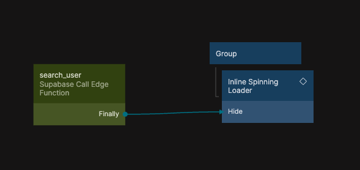

{/*##head##*/}

# Call Edge Function

Calls a specific Supabase Edge Function by name and sends an optional request body.

{/*##main##*/}

<div className="ndl-image-with-background l">
  
</div>

The Call Edge Function node invokes a Supabase Edge Function deployed in your Supabase project. Provide the function name and an optional payload, and Fluxscape will execute the request and return the response object.

This node is based on the Supabase Client SDK invoke method. For reference, see  
[Supabase Client SDK – Invokes a Supabase Edge Function](https://supabase.com/docs/reference/javascript/functions-invoke).

## Inputs

<div className="ndl-table-35-65">

| Data                                            | Type       | Description |
| ----------------------------------------------- | ---------- | ----------- |
| <span className="ndl-data">Function Name</span> | string     | The name of the Edge Function to invoke (without a URL). |
| <span className="ndl-data">Options</span>       | javascript | A script that returns an options object for the request. |

</div>

Similar to how other scriptable nodes work, you can use `Inputs.Value` inside the Options script to build a dynamic request.

### Options

```js
// Return an options object for the Edge Function invocation.
// Examples: headers, method, responseType, body, etc.
return {
  // headers: {
  //   "my-custom-header": "my-custom-header-value",
  // },
  // method: "POST",
  // responseType: "text",
  body: JSON.stringify(Inputs.Data),
};