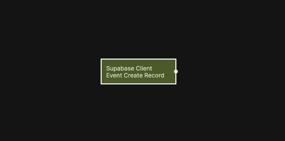

# Supabase Client Event Create Record

Emits a signal when a record is created by the client in Supabase.

  

This node listens for record creation events triggered by client-side actions in Supabase. It allows your app to react immediately when new data is created, such as updating UI state, triggering workflows, or chaining additional logic.

It works similarly to the [Receive Event node](/nodes/events/receive-event), but in this case the event emission is built directly into the Create Record flow, removing the need for a separate Send Event node.

## Inputs

| Data                                             | Type    | Description |
| ------------------------------------------------ | ------- | ----------- |
| Enable         | boolean | Enables filtering by a specific table. When disabled, events from all tables are received. |
| Table Name     | string  | The table to listen to. Only visible when **Enable** is true. |
| Data Object ID | string  | Optional identifier used to scope or correlate the event. |

## Outputs

| Data                                         | Type   | Description |
| -------------------------------------------- | ------ | ----------- |
| On         | signal | Triggered when a matching record creation event is received. |
| Table Name | string | The name of the table where the record was created. |
| Record ID  | string | The identifier of the newly created record. |

