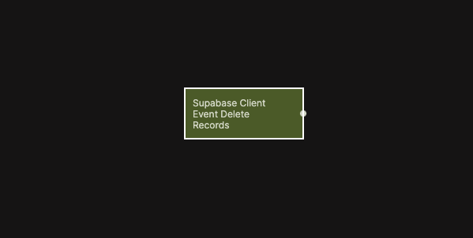

{/*##head##*/}

# Supabase Client Event Delete Records

Emits a signal when one or more records are deleted by the client in Supabase.

{/*##main##*/}

  

This node listens for record deletion events triggered by client-side actions in Supabase. It allows your app to react immediately when records are removed, such as updating lists, refreshing views, or triggering follow-up workflows.

It works similarly to the [Receive Event node](/nodes/events/receive-event),  but in this case the event emission is built directly into the Delete Records flow, removing the need for a separate Send Event node.

## Inputs

| Data                                         | Type    | Description |
| -------------------------------------------- | ------- | ----------- |
| Enable     | boolean | Enables filtering by a specific table. When disabled, events from all tables are received. |
| Table Name | string  | The table to listen to. Only visible when **Enable** is true. |

## Outputs

| Data                                         | Type   | Description |
| -------------------------------------------- | ------ | ----------- |
| On         | signal | Triggered when a matching record deletion event is received. |
| Table Name | string | The name of the table where records were deleted. |

