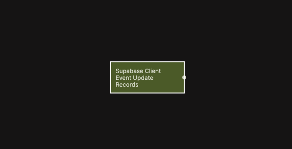

# Supabase Client Event Update Records
 
Emits a signal when one or more records are updated by the client in Supabase.

  

This node listens for record update events triggered by client-side actions in Supabase. It allows your app to react immediately when existing data changes, such as refreshing views, recalculating derived state, or triggering follow-up workflows.

It works similarly to the [Receive Event node](/nodes/events/receive-event),  but in this case the event emission is built directly into the Update Records flow, removing the need for a separate Send Event node.

## Inputs

| Data                                             | Type    | Description |
| ------------------------------------------------ | ------- | ----------- |
| Enable         | boolean | Enables filtering by a specific table. When disabled, events from all tables are received. |
| Table Name     | string  | The table to listen to. Only visible when **Enable** is true. |
| Data Object ID | string  | Optional identifier used to scope or correlate the event. |

## Outputs

| Data                                         | Type   | Description |
| -------------------------------------------- | ------ | ----------- |
| On         | signal | Triggered when a matching record update event is received. |
| Table Name | string | The name of the table where records were updated. |

