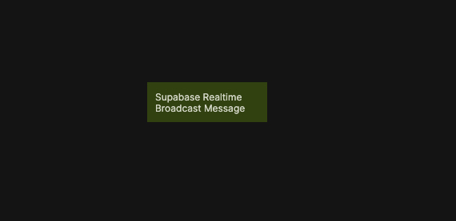

# Supabase Realtime Broadcast Message

Broadcasts a message to a Supabase Realtime channel so other connected clients can react immediately.

  

The Supabase Realtime Broadcast Message node sends an event payload to a Supabase Realtime channel using broadcast messaging. This is useful for lightweight real-time signaling between connected clients, such as notifying other users that something has changed, triggering UI updates, or coordinating collaborative interactions.

Broadcast messages are ephemeral and are not persisted in the database. Only clients that are actively subscribed to the channel at the time of sending will receive the message. If you require persistence or guaranteed processing, consider using database changes or Edge Functions instead.

This functionality is based on the Supabase Client SDK broadcast message method. For reference, see  
[Supabase Client SDK – Broadcast a message](https://supabase.com/docs/reference/javascript/broadcastmessage).