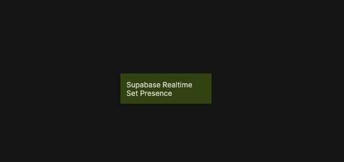

{/*##head##*/}

# Supabase Realtime Set Presence

Sets the presence state for the current user on a Supabase Realtime channel.

{/*##main##*/}

  

The Supabase Realtime Set Presence node updates the presence information for the currently authenticated user on a specified Realtime channel. Presence data is commonly used to track which users are online, active, or participating in a shared context such as a room, document, or collaborative session.

Presence state is ephemeral and exists only while the client is connected to the channel. When a user disconnects or leaves the channel, their presence is automatically removed. This makes it suitable for real-time indicators such as online users, cursors, activity status, or collaboration awareness.

This functionality is based on the Supabase Realtime presence API. Presence updates are broadcast to all clients subscribed to the same channel, allowing UIs to stay in sync as users join, update their state, or leave.

For reference, see 
[Supabase Realtime – Presence](https://supabase.com/docs/guides/realtime/presence).