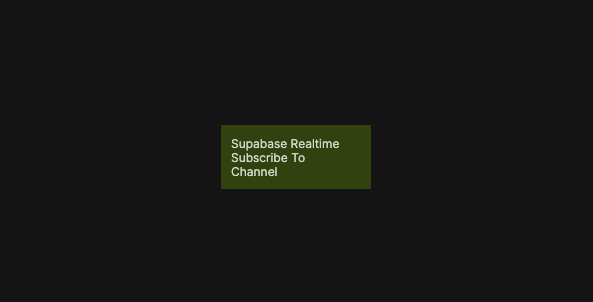

{/*##head##*/}

# Supabase Realtime Subscribe To Channel

Subscribes the client to a Supabase Realtime channel to receive real-time events.

{/*##main##*/}

  

The Supabase Realtime Subscribe To Channel node connects the client to a specified Realtime channel. Once subscribed, the client can receive broadcast messages, presence updates, and other real-time events published on that channel.

This node is typically used as the entry point for real-time features such as live updates, collaborative experiences, activity feeds, or presence-aware interfaces. It is commonly paired with nodes like **Broadcast Message** and **Set Presence** to build complete real-time workflows.

Subscriptions are active as long as the client remains connected. When the client disconnects or unsubscribes, it will stop receiving events from the channel.

This functionality is based on the Supabase Client SDK channel subscription method. For reference, see  [Supabase Client SDK – Subscribe to channel](https://supabase.com/docs/reference/javascript/subscribe).