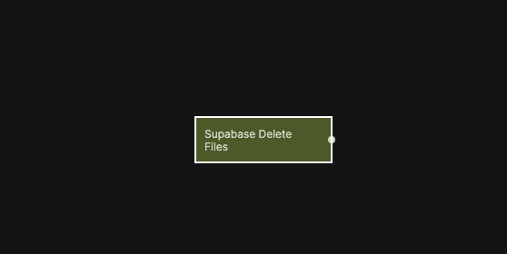

# Supabase Delete Files

Deletes one or more files from a Supabase Storage bucket.

  

This node removes files from the specified Supabase Storage bucket based on the provided file paths. It is commonly used for cleanup operations, user-initiated file removal, or managing stored assets within an application.

Delete operations respect Supabase Storage access policies and the authentication context of the current user.

This functionality is based on the Supabase Client SDK method for deleting files from a bucket. For reference, see  
[Supabase Client SDK – Delete files in a bucket](https://supabase.com/docs/reference/javascript/storage-from-remove).

## Inputs

| Data                                              | Type            | Description |
| ------------------------------------------------- | --------------- | ----------- |
| Delete          | signal          | Triggers the delete operation. |
| Bucket          | string          | The Storage bucket name. |
| Paths to Delete | array of string | One or more file paths to remove from the bucket. |

## Outputs

| Data                                            | Type            | Description |
| ----------------------------------------------- | --------------- | ----------- |
| Deleted Paths | array of string | The file paths that were successfully deleted. |
| Is Deleting   | boolean         | True while the delete operation is in progress. |
| Is Deleted    | boolean         | True once the delete operation has completed. |
| Status        | string          | Status returned from the delete operation. |
| Is Success    | boolean         | True if the files were deleted successfully. |
| Is Error      | boolean         | True if an error occurred. |
| Error Text    | string          | Error message returned by Supabase, if any. |
| Success       | signal          | Triggered when the operation completes successfully. |
| Failure       | signal          | Triggered if the operation fails. |
| Finally       | signal          | Triggered after the operation completes, regardless of outcome. |

