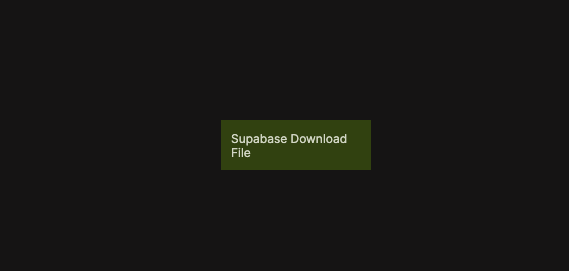

{/*##head##*/}

# Download File

Downloads a file from a Supabase Storage bucket.

{/*##main##*/}

  

This node retrieves a file stored in Supabase Storage and makes its contents available to the app. It can be used to download assets such as images, documents, or data files for display, processing, or client-side handling.

The downloaded file can be accessed in multiple formats depending on your use case, including a raw Blob, text, or an ArrayBuffer.

This functionality is based on the Supabase Client SDK method for downloading files from Storage. For reference, see  
[Supabase Client SDK – Download a file](https://supabase.com/docs/reference/javascript/storage-from-download).

## Inputs

| Data                                                   | Type   | Description |
| ------------------------------------------------------ | ------ | ----------- |
| Download             | signal | Triggers the download operation. |
| Bucket               | string | The Storage bucket name. |
| Path (within bucket) | string | The file path inside the bucket. |

## Outputs

| Data                                                | Type    | Description |
| --------------------------------------------------- | ------- | ----------- |
| File Blob         | *       | The downloaded file as a binary Blob. |
| File Text         | string  | The file contents as text, when applicable. |
| File Array Buffer | *       | The file contents as an ArrayBuffer. |
| Is Downloading    | boolean | True while the download is in progress. |
| Is Downloaded     | boolean | True once the download has completed. |
| Status            | string  | Status returned from the download operation. |
| Is Success        | boolean | True if the file was downloaded successfully. |
| Is Error          | boolean | True if an error occurred. |
| Error Text        | string  | Error message returned by Supabase, if any. |
| Success           | signal  | Triggered when the operation completes successfully. |
| Failure           | signal  | Triggered if the operation fails. |
| Finally           | signal  | Triggered after the operation completes, regardless of outcome. |

