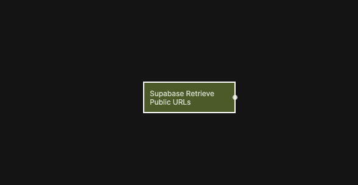

{/*##head##*/}

# Supabase Retrieve Public File URLs

Generates public URLs for one or more files stored in a Supabase Storage bucket.

{/*##main##*/}

  

This node is useful when you want to display images, link to documents, or render media that is stored in Supabase Storage. The result is a list of URLs corresponding to the provided file paths.

Depending on your bucket configuration, the generated URLs may be publicly accessible or time-limited. Expiration can be configured to control how long the URLs remain valid.

This functionality is based on the Supabase Client SDK method for retrieving a public URL. For reference, see  [Supabase Client SDK – Retrieve public URL](https://supabase.com/docs/reference/javascript/storage-from-getpublicurl).

## Inputs

| Data                                                       | Type            | Description |
| ---------------------------------------------------------- | --------------- | ----------- |
| Fetch                    | signal          | Triggers the URL generation. |
| Bucket                   | string          | The Storage bucket name. |
| Paths (array of strings) | array of string | One or more file paths inside the bucket. |
| Expires In (seconds)     | number          | Optional. Used when generating time-limited URLs. |

## Outputs

| Data                                          | Type            | Description |
| --------------------------------------------- | --------------- | ----------- |
| Signed URLs | array of string | The resulting URLs, in the same order as the input paths. |
| Is Fetching | boolean         | True while the request is in progress. |
| Is Fetched  | boolean         | True once the request has completed. |
| Is Success  | boolean         | True if URLs were generated successfully. |
| Is Error    | boolean         | True if an error occurred. |
| Status      | string          | Status returned from the operation. |
| Error Text  | string          | Error message returned by Supabase, if any. |
| Success     | signal          | Triggered when the operation completes successfully. |
| Failure     | signal          | Triggered if the operation fails. |
| Finally     | signal          | Triggered after the operation completes, regardless of outcome. |

