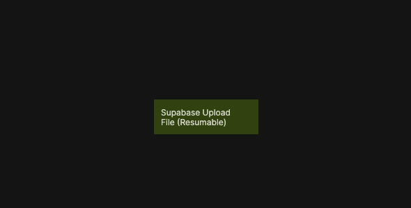

# Supabase Upload File (Resumable)

Uploads a file to Supabase Storage using resumable upload support.

  

This node allows you to upload large files reliably to Supabase Storage. Resumable uploads make it possible to pause, resume, or cancel an upload, which is especially useful for unstable network conditions or large file transfers.

The upload is performed against a specified Storage bucket and path. When enabled, upsert allows an existing file at the same path to be overwritten.

This functionality is based on Supabase’s resumable upload support. For reference, see  
[Supabase – Resumable Uploads](https://supabase.com/docs/guides/storage/uploads/resumable-uploads).

## Inputs

| Data                                                   | Type        | Description |
| ------------------------------------------------------ | ----------- | ----------- |
| Upload               | signal      | Starts the upload process. |
| Bucket               | string      | The Storage bucket name. |
| Path (within bucket) | string      | The destination file path inside the bucket. |
| Upsert               | boolean     | Whether to overwrite an existing file at the same path. |
| File                 | Blob / File | The file or blob to upload. |
| Pause Upload         | signal      | Pauses an ongoing upload. |
| Resume Upload        | signal      | Resumes a paused upload. |
| Cancel Upload        | signal      | Cancels the upload operation. |

## Outputs

| Data                                              | Type    | Description |
| ------------------------------------------------- | ------- | ----------- |
| Upload Progress | number  | Upload progress as a percentage value. |
| Public Url      | string  | Public URL of the uploaded file, if applicable. |
| Is Uploading    | boolean | True while the upload is in progress. |
| Is Uploaded     | boolean | True once the upload has completed successfully. |
| Status          | string  | Current upload status: `idle`, `uploading`, `success`, or `error`. |
| Is Success      | boolean | True if the upload completed successfully. |
| Is Error        | boolean | True if an error occurred. |
| Error Text      | string  | Error message returned by Supabase, if any. |
| Success         | signal  | Triggered when the upload completes successfully. |
| Failure         | signal  | Triggered if the upload fails. |
| Finally         | signal  | Triggered after the upload completes, regardless of outcome. |

