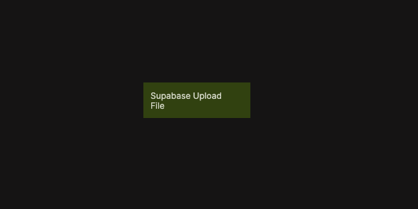

# Supabase Upload File

Uploads a file to an existing Supabase Storage bucket.

  

This node uploads a file directly to Supabase Storage at the specified bucket and path. It is best suited for smaller files or situations where resumable uploads are not required.

When enabled, the upsert option allows an existing file at the same path to be overwritten. Upload operations respect Supabase Storage access policies and are executed in the context of the current user.

This functionality is based on the Supabase Client SDK upload method. For reference, see  
[Supabase Client SDK – Upload a file](https://supabase.com/docs/reference/javascript/storage-from-upload).

## Inputs

| Data                                                   | Type        | Description |
| ------------------------------------------------------ | ----------- | ----------- |
| Upload               | signal      | Triggers the upload operation. |
| Bucket               | string      | The Storage bucket name. |
| Path (within bucket) | string      | The destination file path inside the bucket. |
| Upsert               | boolean     | Whether to overwrite an existing file at the same path. |
| File                 | Blob / File | The file or blob to upload. |

## Outputs

| Data                                             | Type    | Description |
| ------------------------------------------------ | ------- | ----------- |
| File ID        | string  | Identifier returned for the uploaded file, if available. |
| File Path      | string  | The file path within the bucket. |
| File Full Path | string  | The full resolved path to the uploaded file. |
| Public Url     | string  | Public URL of the uploaded file, if applicable. |
| Is Uploading   | boolean | True while the upload is in progress. |
| Is Uploaded    | boolean | True once the upload has completed successfully. |
| Status         | string  | Current upload status: `idle`, `uploading`, `success`, or `error`. |
| Is Success     | boolean | True if the upload completed successfully. |
| Is Error       | boolean | True if an error occurred. |
| Error Text     | string  | Error message returned by Supabase, if any. |
| Success        | signal  | Triggered when the upload completes successfully. |
| Failure        | signal  | Triggered if the upload fails. |
| Finally        | signal  | Triggered after the upload completes, regardless of outcome. |

